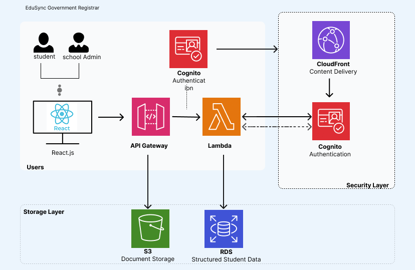

# Eyeni-Mbu Nyellie

**Project Name:** EduSync – National Student Registration Platform

**Project Description:**  
EduSync is a government-focused education platform designed to streamline student registration in public schools across Cameroon. It centralizes student records, automates enrollment processes, and provides administrators, schools, and government agencies with a secure and efficient system for managing student data. A key advantage is that students can transfer between government schools seamlessly without the need for repeated registration, ensuring accuracy and convenience nationwide.

**Key Features:**  
- Centralized student registration and record management  
- Seamless student transfers between government schools with no re-registration required  
- Secure login for students, parents, and school administrators  
- Real-time verification of student information  
- Automated reporting and analytics for government agencies  
- Role-based access control for different government departments  
- Scalable, reliable infrastructure for nationwide usage  

**Technologies & Tools:**  
- **Frontend:** React.js, TypeScript, Tailwind CSS for responsive and modern UI  
- **Backend:** Node.js, Express.js, PostgreSQL or MongoDB for secure and structured data storage  
- **Cloud Services (AWS):**  
  - **AWS S3** – storage for student documents  
  - **AWS Cognito** – secure authentication  
  - **AWS Lambda** – serverless processing for registration workflows  
  - **AWS RDS** – relational database for structured student data  
  - **AWS CloudFront** – fast, reliable content delivery  
  - **AWS API Gateway** – secure API endpoints for government systems  
- **UI/UX & Design:** Figma for prototyping, Canva for design assets.  
- **Other Tools:** Git/GitHub for version control, Postman for API testing, Docker for containerization  

**GitHub Repository:** [https://github.com/nyells/edusync](https://github.com/nyells/edusync)

🏗️ Solution Architecture
System Architecture Overview

The EduSync platform will follow a cloud-native, multi-layer architecture hosted on AWS to ensure scalability, security, and nationwide accessibility.

1️⃣ User Interface Layer

Handles all user interactions.

Components:

Student portal

School admin dashboard

Government admin panel

Technology: React.js + Tailwind CSS

2️⃣ Authentication Layer

Manages secure login and identity verification.

Users:

Students

School officials

Government administrators

Service: AWS Cognito

3️⃣ API Layer

Acts as the communication bridge between frontend and backend.

Service: AWS API Gateway

4️⃣ Business Logic Layer

Processes core workflows:

Student registration

School transfers

Approval processes

Service: AWS Lambda

5️⃣ Database Layer

Stores structured system data:

Student records

School data

Transfer history

Service: AWS RDS

6️⃣ File Storage Layer

Stores uploaded documents:

Birth certificates

Report cards

Identification documents

Service: AWS S3

7️⃣ Content Delivery Layer

Ensures fast access nationwide.

Service: AWS CloudFront

8️⃣ Security & Compliance Layer

Provides system protection:

Role-based access control

Data encryption

Audit logging

Services: AWS IAM + Cognito policies

9️⃣ Integration Layer

Enables future connection with external government systems
(e.g., national ID database).

🔟 Monitoring & Maintenance Layer

Ensures reliability and performance tracking.

Service: AWS CloudWatch
